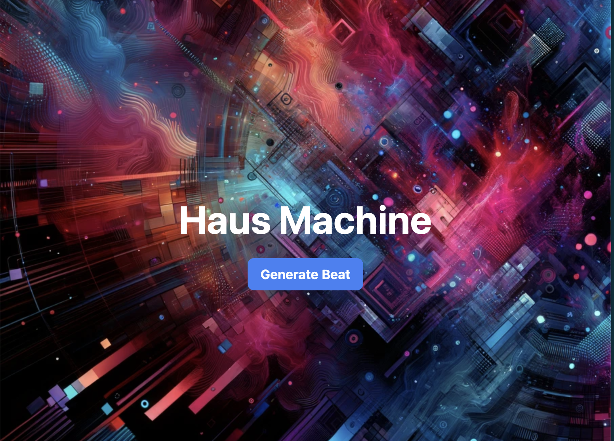

# Haus Machine

Generate 5 seconds of House Music with a Neural Network



## Design

Flask server, celery worker, and the MusicGen project to provide a simple
demo of generating 5s of audio with a button click.

## Setup

Install required python packages:
```
$ pip install -r requirements.txt 
```

For now, we're using bash scripts to run the pieces locally:

In terminal 1: 
```
$ redis-server
```

In terminal 2:
```
$ ./scripts/web
```

In terminal 3:
```
$ ./scripts/worker
```